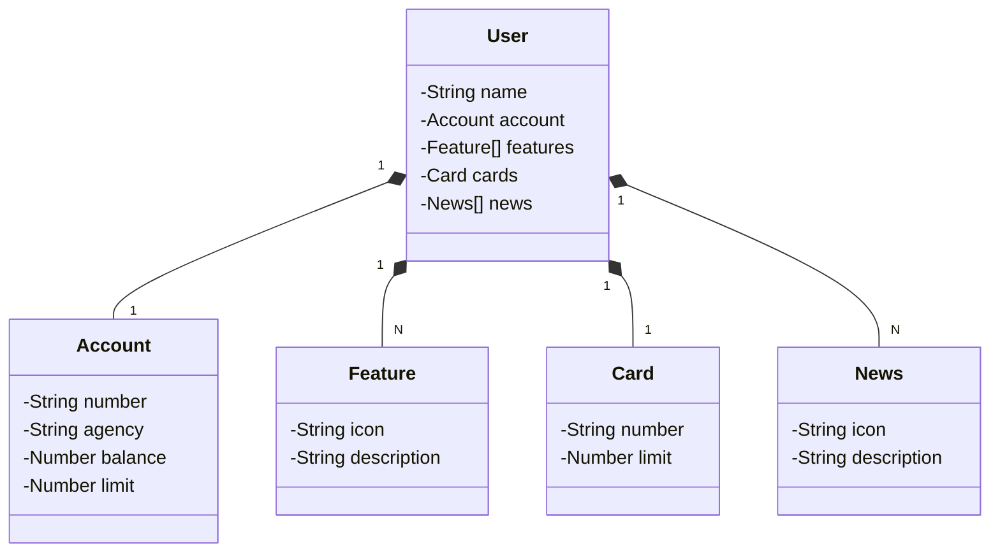

# santander-dev-week-2023
Java RESTful API criada para a santander dev week

## Diagrama de classes

```mermaid
classDiagram
    class User {
        -String name
        -Account account
        -Feature[] features
        -Card cards
        -News[] news
    }

    class Account {
        -String number
        -String agency
        -Number balance
        -Number limit
    }

    class Feature {
        -String icon
        -String description
    }

    class Card {
        -String number
        -Number limit
    }

    class News {
        -String icon
        -String description
    }

    User "1" *-- "1" Account
    User "1" *-- "N" Feature
    User "1" *-- "1" Card
    User "1" *-- "N" News
```
